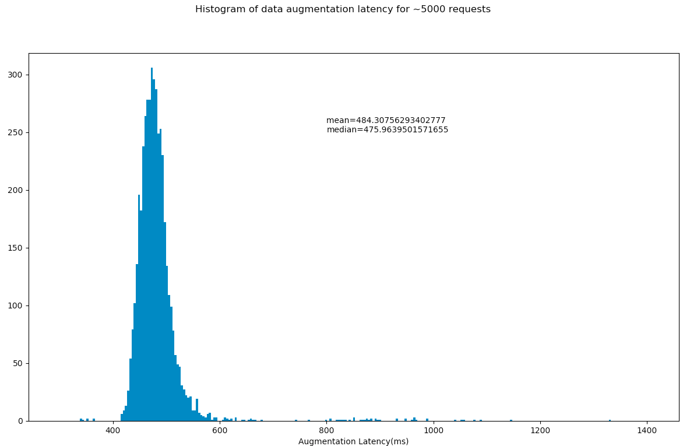

## Ad Request Data Augmentation Pipeline

### Overview
This is a service to take in an incoming ad request from advertiser and pass it thru an data 
augmentation pipeline that augments several contextual information in the following order dictated
by the INDIVIDUAL_PROCESSING_UNITS pipeline:

* fetch country of ad request origin
* inject the demographics of the advertising site
* lookup the publisher site's details

Timed Caching for 24 hours has been enabled for each of the above individual data augmentations
as neither of them is volatile

For measuring latency of each step of pipeline as well as end-to-end latency,
```utils.timit``` function is decorated on each function 

#### Running the service

To run the service, simply run the module 
```python
request_augment_service.py
```

#### Performance Tests

To check the latency of the system, following performance test is added

```python
tests/perf_tests.py
```
To track the latency of end to end augmentation, ``` @utils.timit``` decorator is tweaked
so that tracked times are written to a text file:
```python

def timeit(desc='', persist_to_log=''):
    """
    Simple decorator to compute time of wrapped function
    :param str optional desc: Description of the wrapped function. If not provided uses the wrapped function name
    :param str optional persist_to_log: if provided, write the time computed to the text file
    :return:
    """
    def time_decorator(func):

        def wrapper(*args, **kwargs):
            start = time.time()
            response = func(*args, **kwargs)
            time_taken_ms = (time.time() - start) * 1000
            print('Time taken for %s: %s ms' % (desc if desc else func.__name__, time_taken_ms))
            if persist_to_log:
                with open(persist_to_log, 'a+') as f:
                    f.write(str(time_taken_ms) + ' ')
            return response

        return wrapper

    return time_decorator
```

Usage:
```python

@app.route('/', methods=['POST'])
@timeit('E2E pipeline', 'E2ETime.txt')
def augment_ad_request():
```
The persisted text file - ```E2ETime.txt``` with end to end times is later analyzed by plotting a histogram

#### Findings

Initially the latency on the average was around ~800 ms. Upon further drill down into
individual steps of data pipeline, I found that overall latency was almost equally divided 
amongst the three individual steps. 

A possible explanation could be - overall network latency.

Better network reception brought down the mean of end-to-end latency to **~484ms** as shown below




